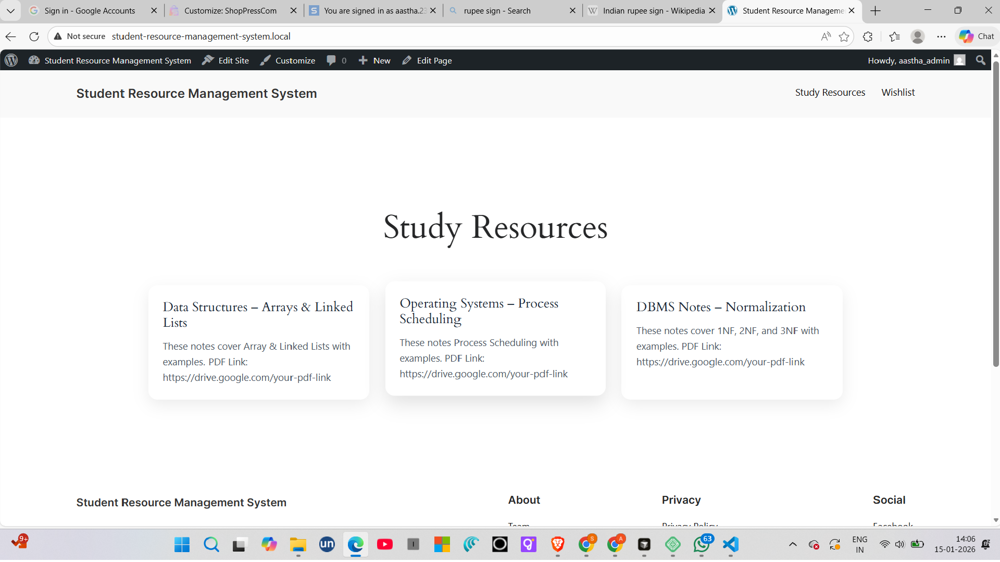

Student Resource Management System (SRMS)

A WordPress-based Student Resource Management System that helps students easily access and manage academic study materials such as notes, PDFs, and subject-wise resources through a clean and user-friendly interface.

🚀 Project Overview

The Student Resource Management System (SRMS) is designed to provide students with a centralized platform where they can:

View subject-wise study resources

Access notes and PDF links

Navigate resources easily using a modern UI

Manage content through WordPress admin

This project is suitable for educational institutions, students, and beginners learning WordPress plugin development.

🛠️ Technologies Used

WordPress

PHP

HTML5

CSS3

Elementor (Page Builder)

LocalWP (Local Development Environment)

✨ Features

📄 Study Resources Page

📂 Subject-wise resource cards

🧩 Custom WordPress plugin structure

🖥️ Easy content management via WordPress dashboard

📸 Screenshots
Home Page

 (Screenshots are stored in the screenshots/ folder).

📁 Project Structure
student-resource-management-system/
│
├── student-resource-management/
│   ├── student-resource-management.php
│
├── screenshots/
│   ├── frontend.png
│   ├── study-resources.png
│
├── README.md

⚙️ Installation Steps

Follow these steps to run the project locally:

1️⃣ Set up WordPress locally

Install LocalWP

Create a new WordPress site

Start the site

2️⃣ Add the Plugin

Go to:

wp-content/plugins/

Create a folder named:

student-resource-management

Add the file:

student-resource-management.php

3️⃣ Activate Plugin

Open WordPress Admin Panel

Go to Plugins → Installed Plugins

Activate Student Resource Management System

🧪 How to Use

Go to Pages → Add New

Create a page named Study Resources

Edit using Elementor

Add cards/sections for:

Data Structures

Operating Systems

DBMS

Insert Google Drive or PDF links

Publish the page

🎯 Use Case

College students

Teachers sharing notes

Educational demo projects

WordPress beginners

Academic mini-projects

📌 Future Enhancements

🔐 User login & role-based access

📤 File upload system

🔍 Search & filter resources

📊 Admin dashboard analytics

📱 Mobile-first UI improvements

👩‍💻 Author

Aastha Singh
B.Tech CSE (AI & ML)
KIET Group of Institutions
GitHub: AasthaSingh2

📄 License

This project is for educational purposes.
You are free to use, modify, and learn from it.

